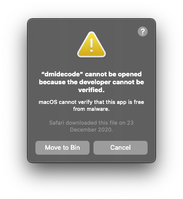
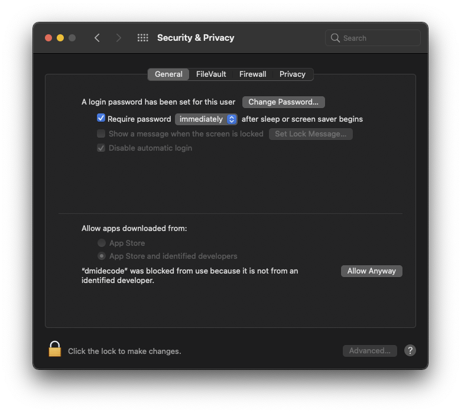
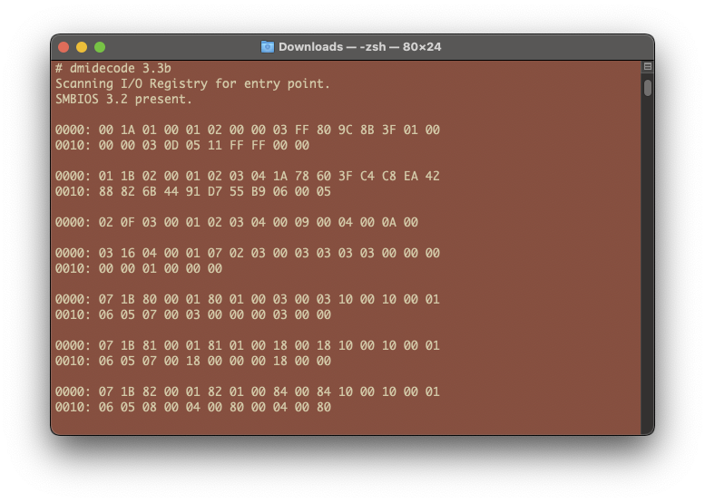

# Gathering the values from your DIMMs using dmidecode

> Ensure your OpenCore config is NOT using `CustomMemory` for this first part of the process. By doing this your low-level EFI/ACPI tables will be what Mac OS is presented with. You will be seeing the physical information directly...
> * Mount your EFI partition
> * Navigate to the EFI folder, OC folder, and edit your config.plist file
> * Find the `PlatformInfo` section, and set the `CustomMemory` key to `false` (or 0, or No, depending on your editor)
> * Save the config.plist file
> * Reboot your hackintosh/ryzentosh

**RESULT**


---

## Download the dmidecode tool

To start, we'll want to grab the following file:

* [dmidecode](https://github.com/acidanthera/dmidecode/releases)
  * Tool used for extracting SMBIOS info in macOS

* Unzip the downloaded file.
  * You will have a command-line executable file in your Downloads folder. 
* Open a Terminal (from Applications/Utilities/Terminal).
* Change directory to your Downloads folder
  * `cd ~/Downloads`
* Run the dmidecode app
  * `./dmidecode -t memory`

> The first time you run the command Mac OS Gatekeeper will probably pop up a warning suggesting that you should delete the dmidecode app.
>  
> * Keep the file by clicking the `Cancel` button.
> * Next, open the `System Preferences` app.
>   * Choose the `Security & Privacy` preference panel.
>     * Under the `General` tab, there should be a message about dmidecode, click the `Allow Anyway` button.
>     

* Run the dmidecode app a second time
  * `./dmidecode -t memory`

> Gatekeeper will again pop up a warning, this time with the option to open.
> Click the `Open` button...
> 

Finally! We get the detailed output from dmidecode...


---

## Let us begin...

The `Memory` section of the OpenCore config.plist file has many properties, lets try to break it down:

* [DataWidth](#datawidth)
* [ErrorCorrection](#errorcorrection)
* [FormFactor](#formfactor)
* [MaxCapacity](#maxcapacity)
* [TotalWidth](#totalwidth)
* [Type](#type)
* [TypeDetail](#typedetail)
* [Devices](#devices)
  * [AssetTag](#assettag)
  * [BankLocator](#banklocator)
  * [DeviceLocator](#devicelocator)
  * [Manufacturer](#manufacturer)
  * [PartNumber](#partnumber)
  * [SerialNumber](#serialnumber)
  * [Size](#size)
  * [Speed](#speed)

---

### DataWidth

Specifies the data width, in bits, of the memory. 

A DataWidth of 64 and a TotalWidth of 64 indicates that the device has 64-bits of data with no error-correction bits.

A DataWidth of 64 and a TotalWidth of 72 indicates that the device has 64-bits of data with 8 error-correction bits.

A DataWidth of 0 and a TotalWidth of 8 indicates that the device is being used solely to provide 8 error-correction bits.

To determine the DataWidth, run the following:

```sh
path/to/dmidecode -t memory | grep "Data Width:"
# Example Output
 Data Width: 64 bits
 Data Width: Unknown
 Data Width: 64 bits
 Data Width: Unknown
 Data Width: 64 bits
 Data Width: Unknown
 Data Width: 64 bits
 Data Width: Unknown
# Final Value
DataWidth = 64
```

---

### ErrorCorrection

Specifies ECC support:

```
1 — Other
2 — Unknown
3 — None
4 — Parity
5 — Single-bit ECC
6 — Multi-bit ECC
7 — CRC
```

To determine ErrorCorrection, run the following:

```sh
path/to/dmidecode -t memory | grep "Error Correction Type:"
# Example Output
 Error Correction Type: None
# Final Value
ErrorCorrection = 3
```

---

### FormFactor

Specifies Memory Form Factor

```
1  — Other
2  — Unknown
9  — DIMM
13 — SODIMM
15 — FB-DIMM
```

To determine FormFactor, run the following:

```sh
path/to/dmidecode -t memory | grep "Form Factor:"
# Example Output
 Form Factor: DIMM
 Form Factor: DIMM
 Form Factor: DIMM
 Form Factor: DIMM
 Form Factor: DIMM
 Form Factor: DIMM
 Form Factor: DIMM
 Form Factor: DIMM
# Final Value
FormFactor = 9
```

---

### MaxCapacity

Specifies maximum supported memory for a Mac Pro 7,1.

The `MaxCapacity` value is dependant upon the type of processor fitted to an Apple Mac Pro 7,1. See [Mac Pro (2019) memory specifications](https://support.apple.com/en-gb/HT210405). The value should be one of:

| Max RAM | Expressed as bytes |
|---------|--------------------|
| 768GB | `824633720832` |
| 1.5TB | `1649267441664` |

Either of these values is okay, but since we are trying to convince Mac OS that the hardware is an Apple Mac Pro, choose the value based on how many cores your system has.

Type: Bytes

```
# Final Value
MaxCapacity = 824633720832
```

---

### TotalWidth

Specifies the total width, in bits, of the memory, including any check or error-correction bits. If there are no error-correction bits, this value should be equal to DataWidth.

To determine TotalWidth, run the following:

```sh
path/to/dmidecode -t memory | grep "Total Width:"
# Example Output
 Total Width: 72 bits
 Total Width: Unknown
 Total Width: 72 bits
 Total Width: Unknown
 Total Width: 72 bits
 Total Width: Unknown
 Total Width: 72 bits
 Total Width: Unknown
# Final Value
TotalWidth = 72
```

---

### Type

Specifies memory type

```
1  — Other
2  — Unknown
15 — SDRAM
18 — DDR
19 — DDR2
20 — DDR2 FB-DIMM
24 — DDR3
26 — DDR4
27 — LPDDR
28 — LPDDR2
29 — LPDDR3
30 — LPDDR4
```

To determine Type, run the following:

```sh
path/to/dmidecode -t memory | grep "Type:"
# Example Output
 Type: DDR4
 Type: Unknown
 Type: DDR4
 Type: Unknown
 Type: DDR4
 Type: Unknown
 Type: DDR4
 Type: Unknown
# Final Value
Type = 26
```

---

### TypeDetail

Specifies other memory type information

```
Bit 0 — Reserved, set to 0
Bit 1 — Other
Bit 2 — Unknown
Bit 7 — Synchronous
Bit 13 — Registered (buffered)
Bit 14 — Unbuffered (unregistered)
````

Combine all that are applicable, example:

```
Bit 13 — Registered (buffered)
Bit 14 — Unbuffered (unregistered)
-----------------------------------
27 = TypeDetail
```

To determine TypeDetail, run the following:

```sh
path/to/dmidecode -t memory | grep "Type Detail:"
# Example Output
 Type Detail: Synchronous
 Type Detail: Synchronous
 Type Detail: Synchronous
 Type Detail: Synchronous
 Type Detail: Synchronous
 Type Detail: Synchronous
 Type Detail: Synchronous
 Type Detail: Synchronous
# Final Value
TypeDetail = 7
```

---

### Devices

The array of Memory Devices, and where we do our magic to fix the error. In the sample CustomMemory.plist provided, we have 12 slots listed. All twelve slots are set up to report an EMPTY Slot.


Next lets break down the properties:

* [AssetTag](#assettag)
* [BankLocator](#banklocator)
* [DeviceLocator](#devicelocator)
* [Manufacturer](#manufacturer)
* [PartNumber](#partnumber)
* [SerialNumber](#serialnumber)
* [Size](#size)
* [Speed](#speed)

---

#### AssetTag

To determine AssetTag, run the following:

```sh
path/to/dmidecode -t memory | grep "Asset Tag:"
#Example Output
Asset Tag: <BAD INDEX>
or
Asset Tag: Not Specified
or
Asset Tag: Some other text
```

* If dmidecode prints `<BAD INDEX>` or `Not Specified`, you can simply leave this entry blank

---

#### BankLocator

To determine BankLocator, run the following:

```sh
path/to/dmidecode -t memory | grep "Bank Locator:"
#Example Output
 Bank Locator: Not Specified
```

* If dmidecode prints `Not Specified`, you can simply leave this entry blank

---

#### DeviceLocator

* For best results use the CustomMemory.plist file values. Do not change them.

---

#### Manufacturer

To determine Manufacturer, run the following:

```sh
path/to/dmidecode -t memory | grep "Manufacturer:"
#Example Output
 Manufacturer: CRUCIAL
```

---

#### PartNumber

To determine PartNumber, run the following:

```sh
path/to/dmidecode -t memory | grep "Part Number:"
#Example Output
 Part Number: KHX2666C16/8G
 Part Number: NO DIMM
 Part Number: KHX2666C16/8G
 Part Number: NO DIMM
 Part Number: KHX2666C16/8G
 Part Number: NO DIMM
 Part Number: KHX2666C15D4/8G
 Part Number: NO DIMM
```

---

#### SerialNumber

To determine SerialNumber, run the following:

```sh
path/to/dmidecode -t memory | grep "Serial Number:"
#Example Output
 Serial Number: 0F095257
 Serial Number: NO DIMM
 Serial Number: 0C099A57
 Serial Number: NO DIMM
 Serial Number: 752EDED8
 Serial Number: NO DIMM
 Serial Number: A2032E84
 Serial Number: NO DIMM
```

---

#### Size

Size of single memory stick in MB. Set this to 0 if the DIMM slot should be EMPTY

```
1GB  - 1024
2GB  - 2048
4GB  - 4096
8GB  - 8192
16GB - 16384
32GB - 32768
64GB - 65536
12GB - 131072
```

To determine Size, run the following:

```sh
path/to/dmidecode -t memory | grep "Size:"
#Example Output
 Size: 8 GB
 Size: No Module Installed
 Size: 8 GB
 Size: No Module Installed
 Size: 8 GB
 Size: No Module Installed
 Size: 8 GB
 Size: No Module Installed
```

---

#### Speed

Speed of memory in Mhz

ex: `3000Mhz`

To determine Speed, run the following:

```sh
path/to/dmidecode -t memory | grep "Speed:"
#Example Output
 Speed: 2666 MT/s
 Speed: Unknown
 Speed: 2666 MT/s
 Speed: Unknown
 Speed: 2666 MT/s
 Speed: Unknown
 Speed: 2666 MT/s
 Speed: Unknown
```


---

On the [previous page](memory.md) we covered the overview of OpenCore's custom memory feature.

On the [next page](memory-presenting-four-dimms.md) we will learn how to gather the correct values using dmidecode.
